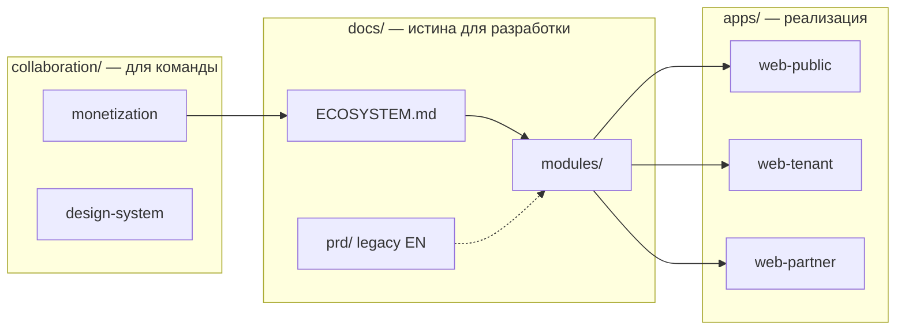

# Memora Platform

White-label SaaS-экосистема для ритуальной индустрии: бронирование, оплаты, CRM, маркетплейс, кладбища.

**Живой демо-сайт:** https://timurkry.github.io/memora-platform/

---

## С чего начать

| Кто вы | Куда идти |
|--------|-----------|
| **Новый в проекте** | Этот README → [`docs/README.md`](docs/README.md) → [`docs/ECOSYSTEM.md`](docs/ECOSYSTEM.md) |
| **Партнёр / продукт** | [`collaboration/README.md`](collaboration/README.md) |
| **Разработчик** | [Быстрый старт](#быстрый-старт) → [`docs/tech-stack.md`](docs/tech-stack.md) |
| **ИИ-агент** | [`AGENTS.md`](AGENTS.md) |

---

## Карта репозитория — что где лежит

```
memora-platform/
│
├── README.md                 ← ВЫ ЗДЕСЬ: обзор проекта и навигация
├── AGENTS.md                 ← Инструкции для ИИ-агентов (архитектор + разработчик)
│
├── apps/                     ← Приложения (код)
│   ├── web-public/           ← B2C сайт Memora (:3000) — поиск, карта, discovery
│   ├── web-tenant/           ← White-label сайт бюро (:3001)
│   ├── web-partner/          ← B2B кабинет — Cases, CRM (:3002)
│   └── web-admin/            ← Админка платформы (:3003)
│
├── packages/
│   └── shared/               ← Общие типы, демо-данные, константы карт
│
├── docs/                     ← ТЕХНИЧЕСКАЯ ДОКУМЕНТАЦИЯ (русский) ★
│   ├── README.md             ← Хаб документации — структура и статусы
│   ├── ECOSYSTEM.md          ← Экосистема: кто что получает, где зарабатываем
│   ├── architecture/         ← Архитектура системы
│   ├── business/             ← Бизнес-модель, цены
│   ├── crm/ · marketplace/   ← Модули по доменам
│   ├── cemetery/ · crematorium/
│   ├── white-label/ · api/
│   ├── user-flows/           ← Пользовательские сценарии
│   ├── security/ · deployment/
│   ├── integrations/         ← Stripe, Mapbox, …
│   ├── decisions/            ← ADR — архитектурные решения
│   ├── prd/                  ← Формальный PRD (англ., legacy)
│   └── tech-stack.md         ← Стек технологий
│
├── collaboration/            ← Работа с партнёршей (RU/DE)
│   ├── monetization-win-win.md
│   ├── design-system.md
│   ├── b2c-client-experience.md
│   ├── b2b-business-owner.md
│   ├── decisions-log.md      ← Журнал решений команды
│   └── backlog.md
│
├── scripts/                  ← Деплой, push на GitHub Pages
├── .github/workflows/        ← CI и Deploy GitHub Pages
└── .cursor/rules/            ← Правила Cursor для агента-документатора
```

### Как связаны папки



| Папка | Язык | Назначение |
|-------|------|------------|
| `docs/` | **Русский** | Архитектура, модули, API, БД — single source of truth |
| `docs/prd/` | English | Ранний PRD; постепенно переносим в `docs/` на русский |
| `collaboration/` | RU / DE | Брифы, дизайн, тексты для партнёра |
| `apps/` | Код | Next.js 15, TypeScript, Tailwind |

---

## Быстрый старт

**Нужно:** Node.js 20+, pnpm 9+

```bash
pnpm install
pnpm dev:public    # B2C → http://localhost:3000
pnpm dev:tenant    # White-label → http://localhost:3001
```

| Приложение | Порт | Для кого |
|------------|------|----------|
| `web-public` | 3000 | Семьи — поиск бюро, карта кладбища |
| `web-tenant` | 3001 | Клиент бюро — брендированный сайт |
| `web-partner` | 3002 | Сотрудник бюро — Cases, CRM |
| `web-admin` | 3003 | Оператор Memora |

**Mapbox локально:** скопируй токен в `apps/web-public/.env.local`:
```env
NEXT_PUBLIC_MAPBOX_TOKEN=pk....
```

---

## Демо-сценарий

1. **http://localhost:3000** — главная Memora, поиск, карта `/karte`
2. **/suchen** — листинг бюро
3. **/demo** — white-label + бронирование → Case `CASE-2026-0042`
4. **http://localhost:3002** — дело в partner portal

---

## Ключевые решения (зафиксированы)

| Решение | Выбор |
|---------|--------|
| Аккаунт клиента | Hybrid — один login, данные per tenant |
| Ядро MVP | **Case** — центральная сущность |
| B2C discovery | **web-public** в MVP |
| Кладбища | Hybrid — cemetery может быть отдельным tenant |
| Монетизация | SaaS + % с оплат + маркетплейс → [`docs/ECOSYSTEM.md`](docs/ECOSYSTEM.md) |

Полный журнал: [`collaboration/decisions-log.md`](collaboration/decisions-log.md)

---

## Деплой (GitHub Pages)

После `git push` сайт обновляется автоматически (~2–3 мин).

| URL | Страница |
|-----|----------|
| `/` | Главная B2C |
| `/karte/` | Интерактивная карта (Mapbox) |
| `/demo/` | White-label демо |

**Секрет для карты на Pages:** GitHub → Settings → Secrets → `MAPBOX_TOKEN`

```powershell
gh run list   # статус деплоя
```

---

## Документация — порядок чтения

1. [`docs/README.md`](docs/README.md) — что в какой папке `docs/`
2. [`docs/ECOSYSTEM.md`](docs/ECOSYSTEM.md) — win-win для всех участников
3. [`collaboration/monetization-win-win.md`](collaboration/monetization-win-win.md) — детали монетизации
4. [`docs/tech-stack.md`](docs/tech-stack.md) — стек
5. Модуль, над которым работаете → `docs/crm/`, `docs/cemetery/`, …

---

*Memora Platform © 2026*
