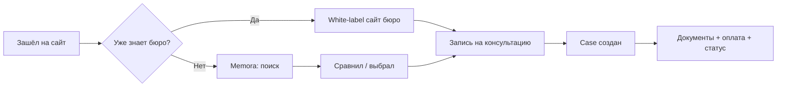

# B2C — Что хочет видеть клиент

> **Персона:** человек, который только что потерял близкого или планирует похороны (Vorsorge).  
> **Состояние:** стресс, усталость, не хочет звонить по 10 номерам, боится скрытых цен.

---

## Эмоциональные потребности (первые 30 секунд)

| Потребность | Как закрываем на сайте | Референс |
|-------------|------------------------|----------|
| «Меня услышат» | Тон: спокойный, без агрессивного маркетинга | Hero: *Wir sind für Sie da* |
| «Не один на один с бюрократией» | 24/7, персональное сопровождение | Sidebar: Erreichbarkeit, Begleitung |
| «Я понимаю, сколько это стоит» | Прозрачные цены, без сюрпризов | Transparente Kosten |
| «Можно доверять» | Рейтинг, отзывы, реальный адрес | 4.9 ★, Standort Leipzig |
| «Не нужно всё сразу» | Мягкий CTA, не «купи сейчас» | Beratung vereinbaren |

---

## Функциональные блоки (по приоритету)

### MVP — must have

1. **Первый экран (Hero)**
   - Заголовок с эмпатией, не «лучший сервис»
   - 1–2 CTA: «Записаться на консультацию» + «Узнать о Vorsorge»
   - Иллюстрация в спокойном стиле (не фото гробов)

2. **Доверие (боковая панель / полоска)**
   - 24/7 доступность (телефон / чат)
   - Персональное сопровождение
   - Прозрачные расходы
   - Рейтинг и число отзывов

3. **Поиск / ориентация**
   - Найти кладбище или бюро по городу
   - «Auf Karte suchen» — карта (Phase 2, placeholder в MVP)

4. **Контакт и локация**
   - Адрес, маршрут, часы работы
   - Один клик — позвонить / написать

5. **Категории услуг (нижняя навигация)**
   - Bestattungsarten (виды похорон)
   - Vorsorge (предварительное планирование)
   - Trauerbegleitung (поддержка в горе)
   - Ratgeber (статьи, гайды)

6. **Онлайн-запись**
   - Выбор услуги → слот → контакт → подтверждение
   - Номер дела (Case) для отслеживания

7. **Личный кабинет (hybrid account)**
   - Статус дела
   - Загрузка документов
   - История платежей

### Phase 2

- Сравнение нескольких бюро
- Онлайн-оплата
- Чат с менеджером
- Калькулятор стоимости
- Мультиязычность (DE / EN / RU)

---

## Чего клиент НЕ хочет видеть

- Яркие «продающие» баннеры, pop-up
- Скрытые цены («от 0 €» без контекста)
- Слишком много полей в форме на первом шаге
- Stock-фото «счастливых людей»
- Агрессивный upsell в момент горя
- Сложную регистрацию до первого контакта

---

## User journey (упрощённо)

---

## Метрики успеха для клиента

- Время до первой записи < 5 мин
- Понятность цен без звонка (опрос / NPS)
- % дел, закрытых без «fallback на телефон»

---

## Открытые вопросы для обсуждения с партнёршей

- [ ] Гостевой checkout или обязательный аккаунт?
- [ ] Показывать ли цены публично или «после консультации»?
- [ ] Нужен ли чат на первом экране?
- [ ] Тон: больше «семейное бюро» или «современная платформа»?

---

*Дополняйте этот файл по мере интервью с реальными клиентами.*
