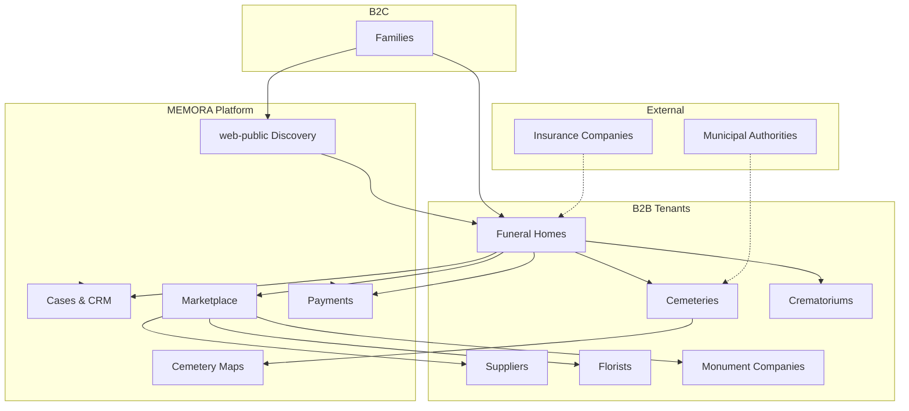
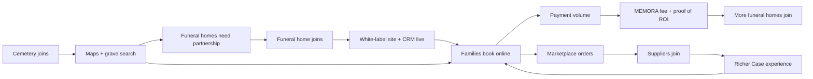

# MEMORA Ecosystem Map

> **Purpose:** Single map of every participant — value, revenue, MEMORA revenue, and network effects.  
> **Business Goal:** Ensure every module serves the ecosystem, not an isolated feature.  
> **Technical Goal:** Guide API boundaries, tenant types, and billing adapters.  
> **Dependencies:** [`prd/02-business-model.md`](prd/02-business-model.md), [`prd/03-business-structure.md`](prd/03-business-structure.md), [`../collaboration/monetization-win-win.md`](../collaboration/monetization-win-win.md)  
> **Related Modules:** All — CRM, marketplace, cemetery, crematorium, white-label, payments  
> **Decision History:** [`decisions/`](decisions/) · [`../collaboration/decisions-log.md`](../collaboration/decisions-log.md)

---

## How to use this document

Before designing any feature, answer for **each affected participant**:

| # | Question |
|---|----------|
| 1 | **What value does the participant receive?** |
| 2 | **How does the participant earn money?** |
| 3 | **How does MEMORA earn from this participant?** |
| 4 | **What network effects appear when they join?** |

If any answer is weak → reconsider scope or business model.

---

## Ecosystem overview

---

## Participant matrix

### Families (B2C)

| Dimension | Detail |
|-----------|--------|
| **Value received** | Discovery, comparison, 24/7 booking, Case status, document upload, online payment, cemetery/grave search, route navigation, memorial page (Phase 2+) |
| **How they earn** | — (consumers; may have insurance payouts, not platform revenue) |
| **MEMORA revenue** | Indirect: payment application fees, marketplace GMV share, featured partner placements; no subscription from families in MVP |
| **Network effects** | More families → more demand signal for funeral homes → more suppliers list products → better comparison → more families |

**MEMORA principle:** B2C is **free at point of use**. Families pay service providers, not MEMORA directly.

---

### Funeral Homes

| Dimension | Detail |
|-----------|--------|
| **Value received** | White-label site, leads from web-public, CRM, Cases, calendar, document workflows, Stripe payments, less phone/paper admin, partner coordination |
| **How they earn** | Service packages (burial, cremation, consultation), upsells, coordination fees |
| **MEMORA revenue** | **SaaS** €79–349/mo · **Payment fee** 1.5–2.5% · **Lead fees** (featured/CPL, Phase 1–2) |
| **Network effects** | Each funeral home → catalog of local partnerships (cemetery, crematorium) → completes ecosystem density in a city |

**Role in ecosystem:** **Orchestrator** — owns Case, payment hub, customer relationship in standard flow.

---

### Cemeteries

| Dimension | Detail |
|-----------|--------|
| **Value received** | Digital plot map, grave search, ceremony slot booking, incoming requests from funeral homes, fewer phone calls, maintenance records, QR at graves (Phase 2+) |
| **How they earn** | Plot lease/sale, ceremony fees, maintenance contracts, perpetual care |
| **MEMORA revenue** | **Cemetery SaaS** €149–299/mo · **Partnership fees** (configurable) · **Digital services** (maps, archive) |
| **Network effects** | Cemetery on platform → funeral homes must integrate to stay efficient → families get grave search + navigation → cemetery becomes discovery entry (cemetery-first GTM) |

**Tenant model:** Cemetery **can be its own tenant** (Hybrid C) with cross-tenant partnerships to funeral homes.

---

### Crematoriums

| Dimension | Detail |
|-----------|--------|
| **Value received** | Online scheduling, capacity management, status updates to funeral homes, document exchange, reporting |
| **How they earn** | Cremation services, urn handling, optional ceremony room |
| **MEMORA revenue** | **SaaS** (Crematorium plan, TBD) · **Transaction fee** on booked cremations via platform |
| **Network effects** | Connected crematorium → funeral homes book slots digitally → shorter Case cycle → more throughput per crematorium |

---

### Suppliers (general)

| Dimension | Detail |
|-----------|--------|
| **Value received** | Access to funeral home network, order inbox, catalog management, payment settlement via hub |
| **How they earn** | Product sales: coffins, urns, accessories, transport |
| **MEMORA revenue** | **Supplier SaaS** €49–99/mo or commission-only · **Marketplace fee** 8–15% per order (Phase 2) |
| **Network effects** | More suppliers → one-stop ordering inside Case → funeral homes prefer platform → more GMV |

---

### Florists

| Dimension | Detail |
|-----------|--------|
| **Value received** | Orders tied to Case (delivery time/place), templates, seasonal catalog, local delivery radius |
| **How they earn** | Flower arrangements, wreaths, delivery fees |
| **MEMORA revenue** | Marketplace commission · optional florist SaaS tier |
| **Network effects** | Florists near cemeteries/churches → faster fulfillment → higher family satisfaction → repeat referrals |

*Subclass of Supplier — separate UX for perishables and delivery windows.*

---

### Monument Companies

| Dimension | Detail |
|-----------|--------|
| **Value received** | Lead from Case, headstone configurator (Phase 2+), approval workflow with cemetery rules, long-lead order tracking |
| **How they earn** | Monuments, engraving, installation |
| **MEMORA revenue** | Marketplace commission (higher ticket → meaningful GMV) · optional SaaS |
| **Network effects** | Cemetery rules integration → compliant orders → cemeteries trust platform → monument companies get qualified leads |

---

### Insurance Companies

| Dimension | Detail |
|-----------|--------|
| **Value received** | Digital claim verification, document exchange, status on funeral cost coverage (Phase 3+) |
| **How they earn** | Premiums; payout management |
| **MEMORA revenue** | **B2B integration fee** · **API access** (Enterprise) · reduced friction → more completed Cases → more payment volume |
| **Network effects** | Insurance API → families see covered amounts upfront → higher conversion on online payment |

**MVP:** Out of scope — document as RFC. Manual upload only.

---

### Municipal Authorities

| Dimension | Detail |
|-----------|--------|
| **Value received** | Compliance reporting, public cemetery data, permit workflows, statistics (Phase 3+) |
| **How they earn** | Taxes, fees, public service mandates |
| **MEMORA revenue** | **Government/enterprise license** · **Per-cemetery municipal contract** |
| **Network effects** | Official cemetery data → authoritative maps → SEO and trust for web-public → more family traffic |

**MVP:** Out of scope — partnership research in Phase 3.

---

### MEMORA Platform (operator)

| Dimension | Detail |
|-----------|--------|
| **Value received** | Scalable SaaS + transaction business, industry data insights, category leadership |
| **How they earn** | SaaS MRR, payment fees, marketplace GMV, leads, premium modules, enterprise contracts |
| **MEMORA revenue** | — |
| **Network effects** | **Multi-sided platform:** each new participant type increases value for all others (Metcalfe on local funeral market density) |

---

## Summary table

| Participant | Value received | Participant earns | MEMORA earns | Network effect |
|-------------|----------------|-------------------|--------------|----------------|
| **Family** | One journey, status, pay online | — | Payment fee, GMV (indirect) | Demand drives supply |
| **Funeral home** | CRM, site, leads, ops | Services | SaaS + payment fee + leads | Orchestrator hub per city |
| **Cemetery** | Digital ops, maps, slots | Plots, ceremonies | Cemetery SaaS + partnership | Grave search draws families |
| **Crematorium** | Scheduling, capacity | Cremation | SaaS + transaction fee | Faster Case closure |
| **Supplier** | Order channel | Product sales | Marketplace % + SaaS | Catalog completeness |
| **Florist** | Timed delivery orders | Arrangements | Marketplace % | Local fulfillment mesh |
| **Monument co.** | Qualified leads | Monuments | Marketplace % (high ticket) | Cemetery rule compliance |
| **Insurance** | Claim automation | Premiums | API / enterprise fee | Payment conversion ↑ |
| **Municipality** | Compliance, data | Public mandate | Enterprise license | Trust + official maps |

---

## Revenue flywheel

---

## Module ↔ participant map

| Module | Primary participants | MEMORA revenue hook |
|--------|---------------------|---------------------|
| web-public | Family | Leads, SEO, brand |
| web-tenant | Family, Funeral home | SaaS retention |
| Cases / CRM | Funeral home, Family | SaaS, stickiness |
| Payments | All B2B, Family | Application fee |
| Marketplace | Supplier, Florist, Monument, Funeral home | Commission |
| Cemetery | Cemetery, Family, Funeral home | Cemetery SaaS |
| Crematorium | Crematorium, Funeral home | SaaS + booking fee |
| White-label | All B2B tenants | Tiered SaaS |
| Insurance API | Insurance, Funeral home | Enterprise (future) |

---

## Open questions

| # | Question | Impact |
|---|----------|--------|
| 1 | Lead model: Featured vs CPL vs rev-share? | web-public monetization |
| 2 | Cemetery-first vs funeral-home-first GTM in DE? | Sales order, partnership schema |
| 3 | Charge families ever (memorial premium)? | B2C ethics, brand |
| 4 | Insurance in Phase 2 or 3? | Integration scope |
| 5 | Municipal data licensing model? | Cemetery map authority |

---

## Risks

| Risk | Mitigation |
|------|------------|
| Perceived exploitation of bereaved | B2C free; transparent fees on B2B |
| Low multi-sided density in small towns | City-by-city launch; anchor cemetery OR funeral home |
| Supplier disintermediation | Orders locked to Case workflow |
| GDPR on family data | Hybrid account, per-tenant isolation |

---

## Future improvements

- [ ] Per-city ecosystem density score (KPI)
- [ ] Automated `ECOSYSTEM.md` consistency check in CI (links)
- [ ] Participant onboarding playbooks linked from each row
- [ ] Insurance and municipal sections → RFC when prioritized

---

*Version 1.0 — 2026-07-09. Update whenever a new participant type or revenue stream is added.*
