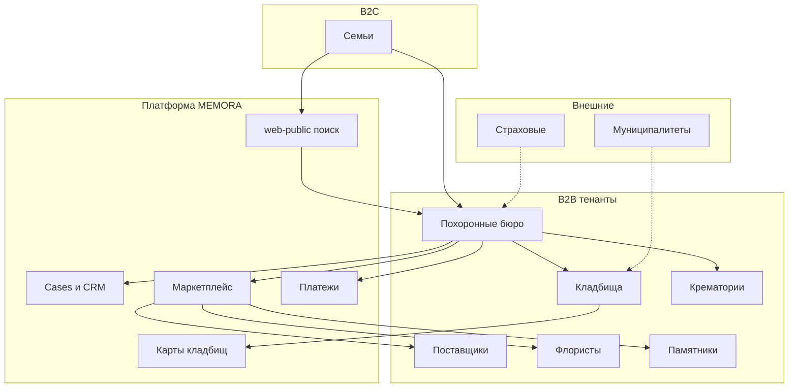
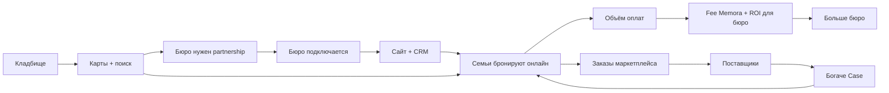

# Карта экосистемы MEMORA

> **Цель:** Единая карта всех участников — ценность, доход участника, доход MEMORA, сетевые эффекты.  
> **Бизнес-цель:** Каждый модуль служит экосистеме, а не изолированной фиче.  
> **Техническая цель:** Границы API, типы tenant, billing adapters.  
> **Зависимости:** [prd/02-business-model.md](prd/02-business-model.md), [prd/03-business-structure.md](prd/03-business-structure.md), [../collaboration/monetization-win-win.md](../collaboration/monetization-win-win.md)  
> **История решений:** [decisions/](decisions/) · [../collaboration/decisions-log.md](../collaboration/decisions-log.md)

---

## Как пользоваться

Перед проектированием любой фичи ответьте для **каждого затронутого участника**:

| # | Вопрос |
|---|--------|
| 1 | **Какую ценность получает участник?** |
| 2 | **На чём этот участник зарабатывает?** |
| 3 | **На чём зарабатывает Memora благодаря ему?** |
| 4 | **Какие сетевые эффекты появляются при его подключении?** |

Слабый ответ на любой пункт → пересмотреть scope или бизнес-модель.

---

## Обзор экосистемы

---

## Участники

### Семьи (B2C)

| Измерение | Детали |
|-----------|--------|
| **Ценность** | Поиск, сравнение, запись 24/7, статус дела, документы, оплата онлайн, поиск могилы, маршрут, страница памяти (Phase 2+) |
| **Заработок** | — (платят только за услуги бюро; страховые выплаты — вне платформы) |
| **Доход Memora** | Косвенно: % с оплат, GMV маркетплейса, платные размещения; подписки с семей в MVP нет |
| **Сетевой эффект** | Больше семей → спрос для бюро → больше поставщиков → лучше сервис → больше семей |

**Принцип:** B2C **бесплатно**. Семья платит исполнителям услуг, не Memora.

---

### Похоронные бюро

| Измерение | Детали |
|-----------|--------|
| **Ценность** | White-label сайт, лиды с web-public, CRM, Cases, календарь, документы, Stripe, меньше звонков и Excel |
| **Заработок** | Пакеты услуг, допродажи, координация |
| **Доход Memora** | **SaaS** €79–349/мес · **% с оплат** 1,5–2,5% · **Лиды** (featured/CPL, Phase 1–2) |
| **Сетевой эффект** | Каждое бюро → локальные партнёрства (кладбище, крематорий) → плотность экосистемы в городе |

**Роль:** **Оркестратор** — владеет Case, хаб оплат, отношения с клиентом.

---

### Кладбища

| Измерение | Детали |
|-----------|--------|
| **Ценность** | Цифровая карта, поиск могил, слоты церемоний, запросы от бюро, меньше звонков, QR на могилах (Phase 2+) |
| **Заработок** | Участки, церемонии, уход, perpetual care |
| **Доход Memora** | **Cemetery SaaS** €149–299/мес · **Партнёрские fee** · Цифровые сервисы |
| **Сетевой эффект** | Кладбище на платформе → бюро интегрируются → семьи ищут могилы → cemetery-first GTM |

**Модель tenant:** Кладбище **может быть отдельным tenant** (Hybrid C).

---

### Крематории

| Измерение | Детали |
|-----------|--------|
| **Ценность** | Онлайн-расписание, ёмкость, статусы для бюро, документы, отчёты |
| **Заработок** | Кремация, урны, зал прощания |
| **Доход Memora** | **SaaS** (тариф TBD) · **Fee** с бронирований |
| **Сетевой эффект** | Цифровые слоты → быстрее закрытие Case → больше пропускная способность |

---

### Поставщики

| Измерение | Детали |
|-----------|--------|
| **Ценность** | Канал заказов, каталог, расчёты через хаб бюро |
| **Заработок** | Гробы, урны, аксессуары, транспорт |
| **Доход Memora** | **SaaS** €49–99/мес или только % · **Маркетплейс** 8–15% (Phase 2) |
| **Сетевой эффект** | Больше поставщиков → заказ в одном Case → бюро не уходит с платформы |

---

### Флористы

| Измерение | Детали |
|-----------|--------|
| **Ценность** | Заказы к Case (время/место доставки), каталог, радиус |
| **Заработок** | Композиции, венки, доставка |
| **Доход Memora** | % маркетплейса · опциональный SaaS |
| **Сетевой эффект** | Локальная доставка у кладбищ/церквей → удовлетворённость семьи |

*Подтип поставщика — отдельный UX для скоропортящихся товаров.*

---

### Компании по памятникам

| Измерение | Детали |
|-----------|--------|
| **Ценность** | Лиды из Case, конфигуратор (Phase 2+), согласование с правилами кладбища |
| **Заработок** | Памятники, гравировка, установка |
| **Доход Memora** | % маркетплейса (высокий чек) |
| **Сетевой эффект** | Соответствие правилам кладбища → доверие → качественные лиды |

---

### Страховые компании

| Измерение | Детали |
|-----------|--------|
| **Ценность** | Верификация выплат, обмен документами (Phase 3+) |
| **Заработок** | Премиумы, выплаты |
| **Доход Memora** | B2B интеграция · Enterprise API |
| **Сетевой эффект** | Семья видит покрытие заранее → выше конверсия оплаты |

**MVP:** вне scope — только ручная загрузка документов.

---

### Муниципалитеты

| Измерение | Детали |
|-----------|--------|
| **Ценность** | Отчётность, публичные данные кладбищ, разрешения (Phase 3+) |
| **Заработок** | Налоги, госуслуги |
| **Доход Memora** | Enterprise-лицензия · контракт на кладбище |
| **Сетевой эффект** | Официальные карты → SEO и доверие web-public |

**MVP:** вне scope.

---

### Платформа MEMORA (оператор)

| Измерение | Детали |
|-----------|--------|
| **Ценность** | Масштабируемый SaaS + транзакции, лидерство в нише |
| **Заработок** | MRR, payment fees, GMV, лиды, enterprise |
| **Сетевой эффект** | Каждый новый тип участника усиливает ценность для всех (многосторонняя платформа) |

---

## Сводная таблица

| Участник | Ценность | Заработок участника | Доход Memora | Сетевой эффект |
|----------|----------|---------------------|--------------|----------------|
| **Семья** | Один путь, статус, оплата | — | % с оплат (косвенно) | Спрос тянет предложение |
| **Бюро** | CRM, сайт, лиды | Услуги | SaaS + % + лиды | Хаб оркестрации в городе |
| **Кладбище** | Цифра, карты, слоты | Участки, церемонии | Cemetery SaaS | Поиск могил → трафик |
| **Крематорий** | Расписание | Кремация | SaaS + fee | Быстрее Case |
| **Поставщик** | Канал заказов | Товары | % + SaaS | Полнота каталога |
| **Флорист** | Доставка к сроку | Композиции | % маркетплейса | Локальная сеть |
| **Памятники** | Лиды | Монументы | % (высокий чек) | Правила кладбища |
| **Страховая** | Автоматизация | Премиумы | Enterprise API | Конверсия оплаты |
| **Муниципалитет** | Compliance | Госмандат | Лицензия | Доверие и карты |

---

## Летучее колесо выручки

---

## Модули ↔ участники

| Модуль | Участники | Крючок дохода Memora |
|--------|-----------|----------------------|
| web-public | Семья | Лиды, SEO |
| web-tenant | Семья, бюро | Удержание SaaS |
| Cases / CRM | Бюро, семья | Stickiness SaaS |
| Платежи | Все B2B, семья | Application fee |
| Маркетплейс | Поставщики, бюро | Комиссия |
| Кладбище | Кладбище, семья, бюро | Cemetery SaaS |
| Крематорий | Крематорий, бюро | SaaS + fee |
| White-label | Все B2B | Тарифы SaaS |

---

## Открытые вопросы

| # | Вопрос | Влияние |
|---|--------|---------|
| 1 | Лиды: Featured vs CPL vs rev-share? | Монетизация web-public |
| 2 | GTM: кладбище-first или бюро-first в DE? | Порядок продаж |
| 3 | Платный memorial для семей? | Этика бренда |
| 4 | Страховые — Phase 2 или 3? | Scope интеграций |
| 5 | Модель лицензии муниципальных данных? | Авторитет карт |

---

## Риски

| Риск | Митигация |
|------|-----------|
| Эксплуатация горя | B2C бесплатно; прозрачные fee с B2B |
| Низкая плотность в малых городах | Запуск город за городом; якорь — бюро или кладбище |
| Обход маркетплейса | Заказы только внутри Case |
| GDPR | Hybrid account, изоляция per tenant |

---

*Версия 1.1 — 2026-07-09. Обновлять при добавлении участника или потока выручки.*
