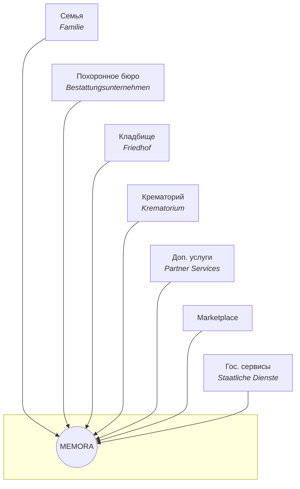
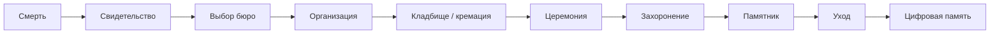
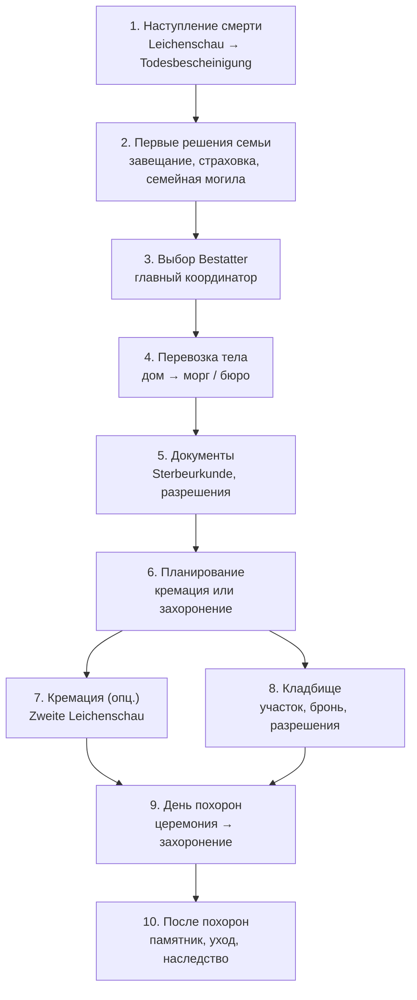
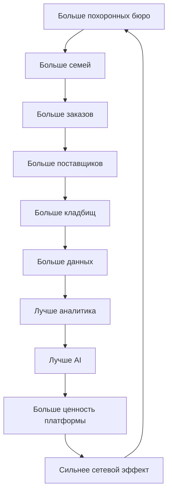

# Инфографика экосистемы MEMORA

> **Цель:** Единая визуальная модель экосистемы для инвесторов, команды и партнёров.  
> **Бизнес-цель:** Показать MEMORA как центральную платформу и операционную систему отрасли.  
> **Техническая цель:** Зафиксировать границы модулей, потоки данных и точки монетизации.  
> **Зависимости:** [ECOSYSTEM.md](../ECOSYSTEM.md) · [monetization-win-win.md](../../collaboration/monetization-win-win.md)  
> **Интерактивная версия (GitHub Pages):** [timurkry.github.io/memora-platform/oekosystem/](https://timurkry.github.io/memora-platform/oekosystem/)  
> **Markdown на GitHub:** [service-lifecycle.md](../user-flows/service-lifecycle.md)

---

## Слоган

**MEMORA** — операционная система мировой ритуальной индустрии  
*(Operating System for the Global Memorial Industry)*

Одна платформа · Каждый участник · Каждый процесс · Каждая страна

---

## Центр: MEMORA

**Digitale Infrastruktur der Bestattungsbranche**  
*Цифровая инфраструктура ритуальной отрасли*

Все участники подключены **только к MEMORA**. Прямых связей между участниками нет — данные проходят через платформу.



> Линии `~~~` — участники **не** связаны напрямую; все интеграции идут через MEMORA.

---

## Три платформы (ядро монетизации)

| # | Платформа | Для кого | Доход MEMORA |
|---|-----------|----------|--------------|
| **1** | **White Label SaaS** | Похоронные бюро | Ежемесячная подписка |
| **2** | **Платформа управления отраслью** | Кладбища, крематории, бюро, флористы, производители, перевозчики, госструктуры | Enterprise-подписка, premium-модули |
| **3** | **Marketplace** | Гробы, урны, венки, цветы, памятники | Комиссия с продаж |

### Сегодня (MVP-фокус)

MEMORA ещё **не** покрывает все этапы — мы строим **мосты** на рынках Европы и Америки:

1. **White Label SaaS** для похоронных агентств → подписка с бюро  
2. **Платформа управления** дополнительными бизнесами отрасли (кладбище, дата, церемония, музыка, гроб, урна, цветы, транспорт и т.д.) → подписка  
3. **Marketplace** ритуальных товаров → комиссия  

---

## Участники экосистемы

### Левая часть — B2C: Семья *(Familie)*

Путь клиента начинается здесь. Семья получает единый цифровой сервис:

| Сервис | DE |
|--------|-----|
| Поиск похоронного бюро | Bestattungsunternehmen |
| Поиск кладбища | Friedhof |
| Поиск могилы | Grabsuche |
| Построение маршрута | Navigation |
| Онлайн-оформление похорон | — |
| Загрузка документов | — |
| Онлайн-оплата | — |
| Страница памяти | — |
| Заказ товаров | — |
| Отслеживание статуса | — |

**Доход MEMORA:** рост трафика → лиды для бюро → подписки и комиссии.

---

### Верх — Похоронное бюро *(Bestattungsunternehmen)*

White Label SaaS — каждое бюро получает собственную платформу.

| Функции | Доход MEMORA |
|---------|--------------|
| Собственный сайт, CRM, онлайн-запись, оплата, документы, сотрудники, календарь, аналитика, автоматизация | **Подписка SaaS** |

---

### Правый верх — Кладбище *(Friedhof)*

Цифровая система управления кладбищем.

| Функции | Доход MEMORA |
|---------|--------------|
| Интерактивная карта, участки, поиск могил, навигация, QR, архив, бронирование, захоронения, аналитика | **Подписка · лицензия · модули** |

---

### Правая сторона — Крематорий *(Krematorium)*

| Функции | Доход MEMORA |
|---------|--------------|
| Планирование загрузки, очередь, бронирование, документы, оплаты, статусы | **Подписка · Enterprise** |

---

### Правый низ — Дополнительные услуги *(Partner Services)*

Флористы · музыка · транспорт · кейтеринг · памятники · гравировка · фото · уход за могилами.

Каждая компания — собственный кабинет.  
**Доход MEMORA:** подписка · комиссия.

---

### Низ — Marketplace

| Категории | DE | Доход |
|-----------|-----|-------|
| Гробы | Särge | |
| Урны | Urnen | |
| Венки | Kränze | **Комиссия** |
| Цветы | Blumen | с каждой |
| Памятники | Grabsteine | продажи |
| Кресты | Kreuze | |
| Мемориальные аксессуары | — | |

---

### Левый низ — Государственные сервисы *(Staatliche Dienste)*

Будущие интеграции: регистрация смерти, документы, разрешения, государственные API.

---

## Жизненный цикл услуги (сильная визуализация)

Горизонтальная цепочка — **сопровождение на всём пути**, а не один продукт.



### MEMORA на каждом этапе

| Этап | Участники | Сервисы MEMORA (сегодня → цель) |
|------|-----------|----------------------------------|
| Смерть, свидетельство | Врач, семья | Информирование семьи · будущие гос. API |
| Выбор бюро | Семья, бюро | **web-public** поиск · White Label сайт бюро |
| Организация, документы | Бюро | **CRM · Case · документы · оплата** |
| Кладбище / кремация | Бюро, кладбище, крематорий | **Карты · бронирование · статусы** |
| Церемония, товары | Бюро, партнёры | **Marketplace · партнёрский кабинет** |
| Захоронение, после | Семья, кладбище | **Навигация · QR · страница памяти** |
| Памятник, уход | Партнёры | **Marketplace · заказы · уход** |
| Цифровая память | Семья | **Memorial page · архив** |

---

## Процесс в Германии — step by step

Официальный типовой путь (упрощённо, по открытым источникам).



### Краткая англоязычная цепочка (as-is рынок)

```
Death → Doctor → Death Certificate → Family → Search Funeral Home
→ Consultation → Transportation → Documents → Cemetery
→ Crematorium (optional) → Funeral → Burial → Aftercare
```

### Где MEMORA становится мостом

| Этап DE | Роль MEMORA сегодня | Цель |
|---------|---------------------|------|
| 1–2 | Информация для семьи | Гайды, чек-листы |
| 3 | Поиск и сравнение бюро | **web-public /suchen** |
| 4–5 | Координация через бюро | **CRM бюро, документы** |
| 6–8 | Планирование услуг | **Платформа №2, карты** |
| 9 | День похорон | Статусы, маршруты |
| 10 | Aftercare | Marketplace, память |

---

## Сетевой эффект (flywheel)



---

## Принципы визуального стиля (для презентаций)

| Правило | Значение |
|---------|----------|
| Фон | Белый `#FFFFFF` |
| Типографика | Чёрная, швейцарская сетка |
| Воздух | Много whitespace |
| Цвет | Минимум — чёрный + один акцент при необходимости |
| Линии | Тонкие, 1px |
| Эффекты | Без теней, без градиентов |
| Тон | Apple · Stripe · McKinsey · Linear · Notion |

---

## Связанные документы

| Документ | Содержание |
|----------|------------|
| [ECOSYSTEM.md](../ECOSYSTEM.md) | Win-win матрица по участникам |
| [user-flows/](../user-flows/) | Детальные пользовательские сценарии |
| [prd/05-user-flows.md](../prd/05-user-flows.md) | Legacy user flows (EN) |

---

*Обновлено: 2026-07-09*
