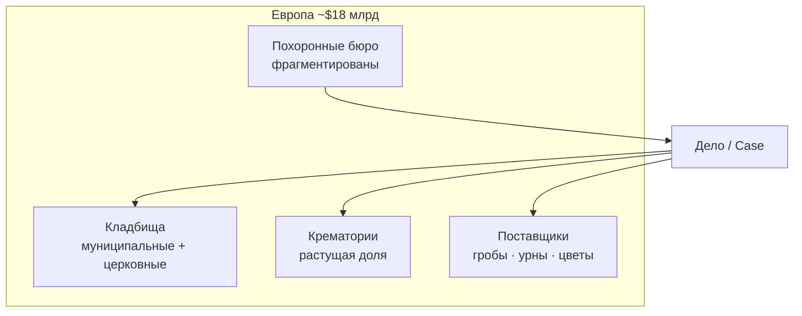
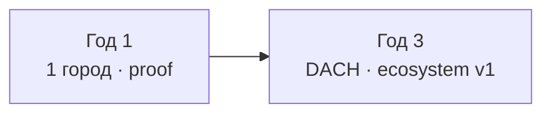
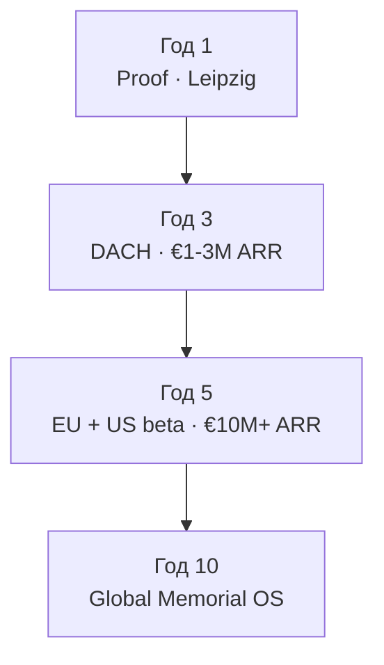

# Анализ рынка: Европа и США + стратегия 1 / 3 / 5 / 10 лет

> **Цель:** Зафиксировать размер рынка, структуру, точку входа и горизонты роста MEMORA.  
> **Бизнес-цель:** Ворваться на рынок с доказуемой моделью, не распыляясь на «всю экосистему сразу».  
> **Техническая цель:** Приоритеты продукта и локализации по фазам.  
> **Зависимости:** [ECOSYSTEM.md](../ECOSYSTEM.md) · [monetization-win-win.md](../../collaboration/monetization-win-win.md) · [service-lifecycle.md](../user-flows/service-lifecycle.md) · [prd/12-roadmap.md](../prd/12-roadmap.md)  
> **Обновлено:** 2026-07-09

---

## Резюме для решений

| Вопрос | Ответ |
|--------|--------|
| **Где начать?** | Германия, один город (Лейпциг) → DACH |
| **Кого продавать первым?** | Независимые похоронные бюро (3–15 чел.) |
| **Что продавать?** | SaaS «цифровое бюро» + Case workflow, не marketplace |
| **Когда EU vs US?** | EU — год 1–3; US — подготовка с года 3, вход с года 5 |
| **Почему сейчас?** | Фрагментация, рост кремации, давление на прозрачность, слабая цифра у малых бюро |

---

## 1. Размер рынка (макро)

### Глобальный контекст

| Регион | Оценка рынка (2024–2025) | CAGR | Источник / примечание |
|--------|--------------------------|------|------------------------|
| **США** | ~$19–20 млрд (рынок похоронных домов) | ~5,9% (2026–2031) | [Mordor Intelligence](https://www.mordorintelligence.com/industry-reports/us-funeral-homes-market) |
| **Европа** | ~$17–18 млрд (2024–2025) | ~5,5% (2025–2030) | [Grand View Research](https://www.grandviewresearch.com/industry-analysis/europe-funeral-homes-services-market-report) |
| **Глобально** | EU ≈ 24,5% мирового рынка (2024) | — | GVR, EU segment |

> Цифры — **оборот отрасли** (услуги + товары), не TAM для SaaS. Для MEMORA релевантен **SAM** — доля, которую можно оцифровать через подписку и транзакции.

### Германия — пляцдарм (beachhead)

| Показатель | Значение | Источник |
|------------|----------|----------|
| Стербефälle в год | ~1,0–1,03 млн | [Destatis 2024–2025](https://www.destatis.de/) |
| Похоронные предприятия | ~4 200–6 800* | Destatis ~4 200; отраслевые базы до ~6 800 |
| Оборот отрасли (DE) | ~€2,3–3,6 млрд | Destatis ~€2,32 млрд (2023); IBISWorld ~€3,6 млрд (2026) |
| Средний чек похорон | €3 000–7 000 | Отраслевые обзоры |
| Доля кремации | **~78%** (DE, 2024) | [Cremation statistics EU](https://treeurn.eu/cremation-statistics-europe-2024/) |
| Размер бюро | чаще 3–5 сотрудников | Bestatter-Atlas, Domradio |
| Структура | **крайне фрагментирована**, семейный бизнес | IBISWorld, Aeternitas |

\* Разброс из‑за разных кодов WZ (только Bestatter vs. вся отрасль включая крематории/кладбища).

**Вывод:** ~1 млн дел в год ÷ ~5 000 бюро ≈ **~200 дел на бюро в год** (среднее). Даже 1% рынка = ~10 000 Cases/год через платформу — достаточно для доказательства модели.

---

## 2. Структура рынка

### Европа

| Сегмент | EU-характеристика | Цифровизация | Возможность MEMORA |
|---------|-------------------|--------------|-------------------|
| **Бюро** | Много малых семейных | Низкая–средняя | **Высокая** — CRM, Case, сайт |
| **Кладбища** | Часто муниципалитет | Низкая | **Средняя** — карты, слоты (длинные продажи) |
| **Крематории** | Концентрация выше | Средняя | Средняя — очереди, бронь (фаза 2) |
| **Семья (B2C)** | Сравнение цен растёт | Порталы сравнения | **Высокая** — трафик, лиды (бесплатно) |
| **Поставщики** | Региональные | Низкая | Фаза 2–3 — marketplace |

**Тренды EU (2024–2030):**

- Рост **кремации** (DE 78%, Nordics 85%+, ES впервые >50%)
- **Персонализация** и eco-friendly форматы
- **Прозрачность цен** — давление comparison-порталов
- **Старение населения** → стабильный/растущий объём смертности
- **Консолидация** — сети (пример DE: Ahorn) vs. тысячи микробюро

### США

| Сегмент | US-характеристика | Отличие от EU |
|---------|-------------------|---------------|
| **Бюро** | ~19 000+ funeral homes, консолидация (SCI, Carriage и др.) | Выше корпоратизация |
| **Кремация** | **~63%** (2025), растёт к ~68% к 2029 | Ниже среднего чека vs. burial |
| **Регуляция** | FTC Funeral Rule, штатные лицензии | Сильнее федеральная прозрачность цен |
| **Софт** | PlotBox, Passare, FrontRunner, Gather | Зрелее vertical SaaS |

**Вывод по US:** рынок **больше в деньгах**, но **выше барьер входа** (конкуренция софта, compliance по штатам, sales cycles у сетей). Логично заходить **после** отработки модели в EU.

---

## 3. Конкурентная среда (цифра)

### Германия / EU — прямые и косвенные

| Тип | Примеры | Угроза | Позиция MEMORA |
|-----|---------|--------|----------------|
| Comparison / лиды | Bestattungen.de, MyMoria | Средняя | Мы — **операционная платформа**, не только лиды |
| Консолидация | Ahorn AG | Средняя | Целимся в **независимые** бюро, не в сеть |
| Локальный софт DE | Разрозненные ERP/календари | Низкая–средняя | Единый Case + экосистема |
| Cemetery tech EU | PlotBox (UK/IE), локальные GIS | Низкая на старте | Карта + hub для бюро |
| US SaaS (позже) | Passare, Gather | На US-входе | Локализация + EU-first |

**Ниша MEMORA:** не «ещё один сайт» и не «ещё один агрегатор», а **операционная система дела** — от лида до закрытия Case с мостами к кладбищу и поставщикам.

---

## 4. TAM / SAM / SOM (оценка для MEMORA)

### Методология

- **TAM** — вся выручка, которую теоретически можно получить от цифровизации отрасли в EU+US
- **SAM** — SaaS + payment fees + marketplace на адресуемых сегментах (бюро, кладбища, поставщики)
- **SOM** — реалистичная доля на горизонте 3–5 лет

### Ориентиры (упрощённо)

| Уровень | EU | US | Комментарий |
|---------|----|----|-------------|
| **TAM (SaaS+fees)** | €800M–1,5B/год | $1,5–2,5B/год | ~5–10% от оборота отрасли как «цифровой слой» |
| **SAM** | €200–400M | $400–800M | Малые/средние бюро + кладбища + fees |
| **SOM (3 года)** | €1–3M ARR | — | 50–150 платящих бюро DE/DACH |
| **SOM (5 лет)** | €8–15M ARR | $2–5M ARR pilot | DACH + 2–3 EU + US early |
| **SOM (10 лет)** | €40–80M ARR | $30–60M ARR | Категорийный игрок EU + US niche |

> Это **планировочные ориентиры**, не финансовый прогноз. Уточнять по мере пилотов (ARPA, churn, take rate).

### Unit economics (пилот DE)

| Метрика | Ориентир |
|---------|----------|
| ARPA бюро (SaaS) | €150–250/мес |
| Payment take rate | 1,5–2,5% от онлайн-оплат |
| Cases/бюро/год | 80–200 |
| CAC (прямые продажи, город) | €500–2 000 |
| Цель LTV/CAC | >3× при churn <15%/год |

---

## 5. Регуляторные различия (EU vs US)

| Тема | Германия / EU | США |
|------|---------------|-----|
| Мед. свидетельство | Todesbescheinigung, Zweite Leichenschau | Death certificate, штатные правила |
| Регистрация смерти | Standesamt | Vital records, county-level |
| Кремация | Строгие правила (DE: 2-й осмотр) | По штатам |
| Цены | Растущая прозрачность | FTC Funeral Rule — itemized GPL |
| Данные | **GDPR** — критично | HIPAA/state privacy |
| Платежи | Stripe EU, SEPA | Stripe US, state tax |

**Стратегия:** архитектура **country packs** — workflow, документы, тексты DE первыми; US — отдельный legal pass перед входом.

---

## 6. Где ворваться: матрица приоритетов

| Сегмент | Скорость сделки | Платёж | Стратегическая ценность | Старт |
|---------|-----------------|--------|-------------------------|-------|
| Независимое бюро | ⭐⭐⭐ | ⭐⭐⭐ | ⭐⭐⭐ | **Да — год 1** |
| web-public / B2C | ⭐⭐ | — | ⭐⭐⭐ (лиды) | **Да — параллельно** |
| Кладбище (1 партнёр) | ⭐ | ⭐⭐ | ⭐⭐⭐ | **Да — год 1, пилот** |
| Крематорий | ⭐ | ⭐⭐ | ⭐⭐ | Год 2 |
| Marketplace | ⭐ | ⭐⭐ | ⭐⭐ | Год 2–3 |
| Сети / Enterprise | ⭐ | ⭐⭐⭐ | ⭐⭐ | Год 3+ |
| США | ⭐ | ⭐⭐⭐ | ⭐⭐⭐ | Год 5+ |

---

## 7. Стратегия по горизонтам

### Год 1 — «Доказать модель в одном городе»

**География:** Лейпциг → Саксония  
**Сегмент:** **5 founding-бюро (€0)** + 1 кладбище-партнёр  

| Квартал | Продукт | GTM | KPI |
|---------|---------|-----|-----|
| Q1 | Case MVP, web-public лиды | Outreach: цель **5 founding** | 2 бюро на платформе |
| Q2 | Stripe ready, cemetery request | 3–4 founding бюро | 10+ Cases |
| Q3 | Calendar, документы v1 | **5-е бюро** — порог proof | **5 бюро · 15 Cases** |
| Q4 | Включить Starter €99 для #6+ | Первые платящие | **€15–30K ARR** run-rate |

**Не делаем до 5 бюро:** брать деньги с клиентов, marketplace, US.

**North star этапа 1:** *5 активных бюро + 15 Cases end-to-end* — **не MRR**.

---

### Год 3 — «DACH + экосистема v1»

**География:** Германия (20–50 городов) + Австрия/Швейцария пилот  
**Сегмент:** малые/средние бюро + 10–20 кладбищ + marketplace lite  

| Направление | Цель |
|-------------|------|
| **Продукт** | Case workflow полный DE, cemetery booking API, каталог гробов/урн (10+ поставщиков) |
| **Клиенты** | 80–150 платящих бюро, 15–25 cemetery tenants |
| **B2C** | SEO DE: 50K+ визитов/мес, измеримая атрибуция лидов |
| **Выручка** | **€1–3M ARR** (70% SaaS, 20% fees, 10% marketplace) |
| **Команда** | 8–15 FTE (eng, sales DE, customer success) |

**Ключевой сдвиг:** от «пилота» к **повторяемому городскому playbook** — один SDR + один CSM на регион.

---

### Год 5 — «Лидер EU niche + подготовка US»

**География:** DACH + Benelux + FR/Nordics pilot + **US beta (1–2 штата)**  
**Сегмент:** + крематории, сети 3–10 филиалов, enterprise tier  

| Направление | Цель |
|-------------|------|
| **Продукт** | Multi-country packs, crematorium module, partner portal, API |
| **Клиенты** | 400–800 бюро EU, 50+ кладбищ, 100+ поставщиков |
| **US** | Legal review, штат TX или FL pilot, англ. продукт |
| **Выручка** | **€8–15M ARR EU** + **$1–3M ARR US** |
| **M&A** | Опционально: поглощение локального софта / comparison portal |

**Позиционирование:** *«Operating system for memorial industry»* в EU — узнаваемый бренд у Bestatter-Verbände.

---

### Год 10 — «Глобальная платформа памяти»

**География:** EU core + UK + US/Canada + LATAM/AU selective  
**Сегмент:** полная экосистема + гос. интеграции + AI layer  

| Направление | Цель |
|-------------|------|
| **Продукт** | Memorial OS: Case, marketplace, gov APIs, digital legacy, analytics/AI |
| **Клиенты** | 5 000+ бюро глобально, 500+ кладбищ, транзакционная сеть |
| **Выручка** | **€50–100M+ ARR** (диверсификация: SaaS 40%, fees 35%, marketplace 25%) |
| **Стратегия** | Категорийный лидер **или** стратегическая продажа / IPO track |

**Сетевой эффект:** больше бюро → больше семей → больше данных → лучше AI/маршруты → выше switching cost.

---

## 8. Риски и митигация

| Риск | Вероятность | Митигация |
|------|-------------|-----------|
| Длинный цикл продаж бюро | Высокая | Founding **€0 до 5 бюро**, один город, личные визиты |
| Консолидация (Ahorn и др.) | Средняя | Фокус на независимых; white-label «ваш бренд» |
| GDPR / мед. данные | Средняя | Минимизация PHI, EU hosting, DPA |
| Низкий онлайн-платёж в отрасли | Высокая | Начать со статусов/документов; Stripe как upsell |
| US regulatory maze | Высокая на US | US только после EU product-market fit |
| Comparison portals как конкуренты | Средняя | Партнёрство или дифференциация через Case |

---

## 9. Связь с roadmap продукта

| Горизонт | prd/12-roadmap | Этот документ |
|----------|----------------|---------------|
| Год 1 | Phase 1 MVP | Leipzig wedge, 3–5 бюро |
| Год 2–3 | Phase 2 Ecosystem | DACH, cemetery + marketplace |
| Год 3–5 | Phase 3 Scale | EU expansion, US prep |
| Год 5–10 | Beyond PRD | Global OS, gov API, AI |

---

## 10. Следующие шаги (операционные)

1. Зафиксировать **ICP** (идеальный пилотный Bestatter) — 1 страница
2. Outreach-лист: **30 бюро Лейпцига** + 5 кладбищ
3. Оффер founding: **€0 · Case + сайт · до набора 5-го бюро**, затем Starter **€99/мес** для новых
4. Метрики дашборда: MRR, Cases closed, lead→Case conversion
5. Ежеквартальный пересмотр SOM по факту пилотов

---

## Источники

- [Destatis — Bestattungshandwerk](https://www.destatis.de/)
- [Grand View Research — Europe Funeral Market](https://www.grandviewresearch.com/industry-analysis/europe-funeral-homes-services-market-report)
- [Mordor Intelligence — US Funeral Homes](https://www.mordorintelligence.com/industry-reports/us-funeral-homes-market)
- [Cremation Statistics Europe 2024](https://treeurn.eu/cremation-statistics-europe-2024/)
- [Bestatter-Atlas Branchenreport](https://bestatter-atlas.de/bestattungsinstitute-branchenreport/)
- Внутренние: [02-business-model.md](../prd/02-business-model.md), [ECOSYSTEM.md](../ECOSYSTEM.md)

---

*Документ — living strategy. Пересматривать после каждого пилотного квартала.*
