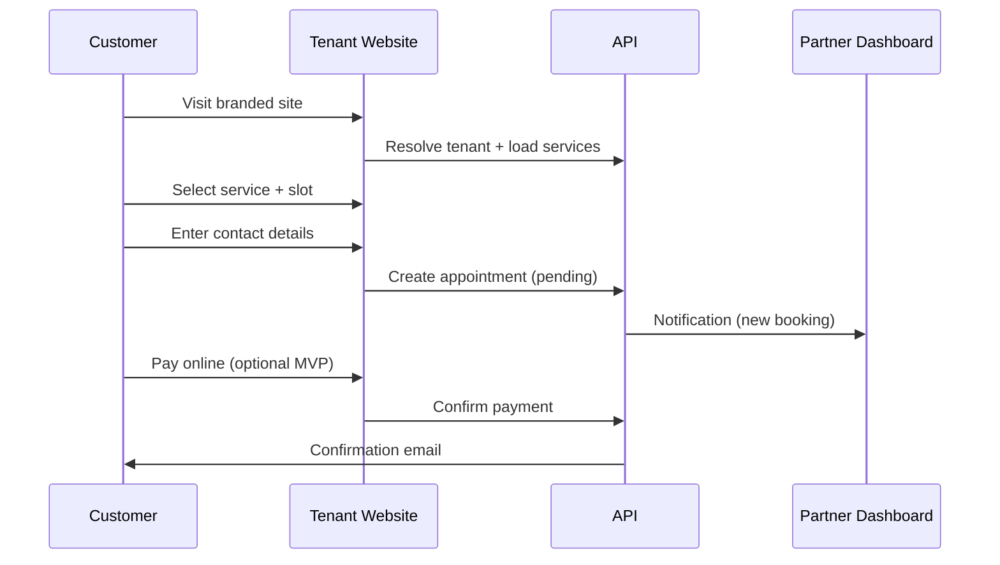

# 05 — User Flows & Journeys

## MVP Flows (Phase 1)

### F1: Customer Books Appointment (B2C)

**Steps:** Land → Browse services → Pick date/time → Contact form → Confirm → (Pay) → Email/SMS confirmation

### F2: Partner Manages Booking (B2B)

Login → Dashboard → Calendar → View appointment → Update status → Add notes → Send message to customer

### F3: Tenant Onboarding

Signup → Choose plan → Organization profile → Branding (logo, colors) → Services setup → Subdomain live → (Later: custom domain)

### F4: Platform Admin Provisions Tenant

Admin panel → Create/suspend tenant → View audit log → Impersonate for support

## Phase 2 Flows

### F5: Marketplace Order
Customer or funeral home → Browse catalog → Add to cart → Checkout → Supplier notified → Fulfillment → Status updates

### F6: Cemetery Plot Inquiry
Customer/funeral home → Search cemetery → Plot availability → Request hold → Ceremony slot → Approval workflow

### F7: Document Upload (Customer)
Booking detail → Upload death certificate / ID → Partner reviews → Status: received / verified / rejected

## Journey Maps (To Expand)

| Journey | Stages | Touchpoints |
|---------|--------|-------------|
| First contact after loss | Awareness → Research → Contact → Book → Pay → Service → Follow-up | Web, email, phone fallback |
| Funeral home daily ops | Morning review → Appointments → New leads → Orders → Close day | Partner portal |
| Supplier fulfillment | Order received → Pick/pack → Ship/deliver → Confirm | Supplier portal |

## Edge Cases (Must Document Before Build)

- Customer cancels / reschedules within policy window
- No availability for selected service
- Payment fails after slot reserved
- Double-booking prevention
- Tenant suspended mid-booking
- Multi-language switch mid-flow

---

*Expand: wireframe links, step-by-step screen inventory per flow*
