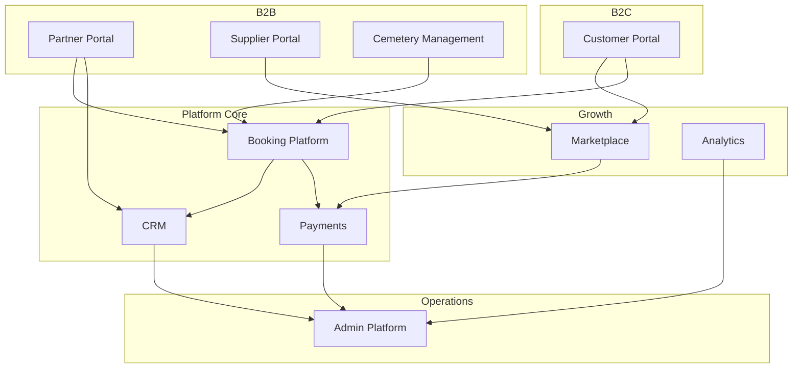

# Memora Platform — Product Requirements Document (PRD)

> **Status:** Outline v0.1 — structure for Cursor and team alignment  
> **Target length:** 50–100 pages when fully expanded  
> **Goal:** Single source of truth so AI and engineers follow one concept — no ad-hoc invention

---

## How to Use This Document

1. **Cursor rules:** Reference `docs/prd/` in `.cursor/rules` or project `AGENTS.md`
2. **Implementation order:** Follow [Roadmap](./12-roadmap.md) phases; do not build Phase 3 features in Phase 1
3. **Ambiguity:** If a feature is not described here, **do not implement** — add to PRD first
4. **Monetization:** Keep models pluggable; see neutral statement in [Business Model](./02-business-model.md)

---

## Document Map

| # | Document | Pages (est.) | Status |
|---|----------|--------------|--------|
| 01 | [Vision & Goals](./01-vision.md) | 4–6 | Outline |
| 02 | [Business Model](./02-business-model.md) | 4–6 | Outline |
| 03 | [Business Structure](./03-business-structure.md) | 6–8 | ✓ Outline |
| 03b | [Market & Launch Strategy](./03-market.md) | 3–5 | Planned |
| 04 | [User Personas & Roles](./04-personas-roles.md) | 5–8 | Outline |
| 05 | [User Flows & Journeys](./05-user-flows.md) | 8–12 | Outline |
| 06 | [Feature Specification](./06-features.md) | 12–18 | Outline |
| 07 | [Data Model & Database](./07-database.md) | 8–12 | Outline |
| 08 | [API Specification](./08-api.md) | 8–12 | Outline |
| 09 | [System Architecture](./09-architecture.md) | 6–10 | Outline |
| 10 | [Tech Stack](./10-tech-stack.md) | 4–6 | → [tech-stack.md](../tech-stack.md) |
| 11 | [Non-Functional Requirements](./11-nfr.md) | 4–6 | Outline |
| 12 | [Roadmap & Phases](./12-roadmap.md) | 4–6 | Outline |
| — | [Glossary](./glossary.md) | 2–3 | Outline |
| — | [Open Questions](./open-questions.md) | ongoing | Outline |

**Total (when expanded):** ~70–110 pages

---

## Product Summary (One Paragraph)

Memora is a white-label, multi-tenant SaaS platform that digitizes the funeral industry in Europe. Business clients (funeral homes, cemeteries, crematoriums, suppliers) receive branded websites, CRM, booking, payments, and analytics on shared infrastructure. End customers discover services, book appointments, upload documents, pay online, and track orders. A marketplace connects suppliers with funeral homes and consumers. Cemetery integration is a strategic distribution channel. The platform is designed to support multiple monetization models without architectural lock-in.

---

## Ecosystem (High Level)



---

## Section Summaries

### 01 — Vision & Goals
- Problem statement (offline industry, fragmented customer journey)
- Product vision: operating system for funeral industry, not a website builder
- Success metrics (North Star, KPIs per phase)
- Non-goals (what we explicitly won't build)

### 02 — Business Model
- Neutral monetization framing (subscriptions, commissions, fees, partnerships)
- B2B vs B2C value proposition
- Pricing tiers (structure only — numbers TBD)
- Cemetery partnership model (principles, not fixed commission %)

### 03 — Market & Launch Strategy
- Initial market: Germany (regulatory, language, cultural notes)
- Expansion: AT, CH, NL, BE, FR, EU
- Go-to-market: cemetery-first distribution hypothesis
- Competitive landscape template

### 04 — Personas & Roles
- B2C: bereaved family, pre-planning customer
- B2B: funeral director, cemetery admin, supplier, driver
- Platform: super-admin, support, sales
- RBAC matrix: role × permission × scope (platform / tenant / org / location)

### 05 — User Flows
- Discovery → compare → book → pay → track
- Funeral home: lead → quote → service → invoice
- Cemetery: plot inquiry → ceremony scheduling
- Supplier: catalog → order fulfillment
- Tenant onboarding: signup → branding → domain → go-live

### 06 — Features
- Module breakdown aligned with NestJS domains
- MVP vs Phase 2 vs Phase 3 per feature
- Acceptance criteria template per epic

### 07 — Database
- ER diagrams per domain
- Tenant isolation rules
- Soft delete, audit, GDPR retention policies
- Indexing and search strategy

### 08 — API
- REST conventions, versioning, error format
- Auth flows (partner, customer, admin, webhooks)
- OpenAPI generation from NestJS
- Rate limits and pagination standards

### 09 — Architecture
- C4 diagrams (context, container, component)
- Multi-tenant request lifecycle
- Event-driven boundaries (sync vs async)
- Integration adapter pattern

### 10 — Tech Stack
- See [tech-stack.md](../tech-stack.md) (canonical)

### 11 — NFR
- Performance SLAs, availability targets
- Security, GDPR, accessibility (WCAG 2.1 AA)
- Localization requirements
- Disaster recovery

### 12 — Roadmap
- Phase 1 MVP (DE): booking + payments + white-label
- Phase 2: marketplace + cemetery module
- Phase 3: AI, advanced analytics, DATEV, NA expansion prep

---

## Writing Conventions for Full PRD

When expanding each section, use this template:

```markdown
## [Feature / Epic Name]

### Problem
What user pain this solves.

### Scope
In scope / Out of scope for this phase.

### User Stories
- As a [role], I want [action], so that [outcome].

### Acceptance Criteria
- [ ] Given … When … Then …

### Dependencies
Other modules, integrations, legal.

### Open Questions
- …
```

---

## Cursor Integration (Recommended)

Add to project root `AGENTS.md` or `.cursor/rules/memora.mdc`:

```markdown
Before implementing any feature:
1. Read docs/prd/ for the relevant module
2. Follow docs/tech-stack.md for technology choices
3. Do not introduce new frameworks without updating tech-stack.md
4. All tenant-scoped tables must include tenant_id
5. Monetization logic must remain adapter-based, not hard-coded
```

---

## Next Steps

1. Expand **01-vision** and **04-personas-roles** (foundation for everything else)
2. Detail **05-user-flows** for MVP booking funnel
3. Write **07-database** core entities for Phase 1
4. Scaffold monorepo per **tech-stack.md**
5. Generate OpenAPI stub from **08-api** module list

---

*PRD Outline v0.1 — 2026-07-05*
