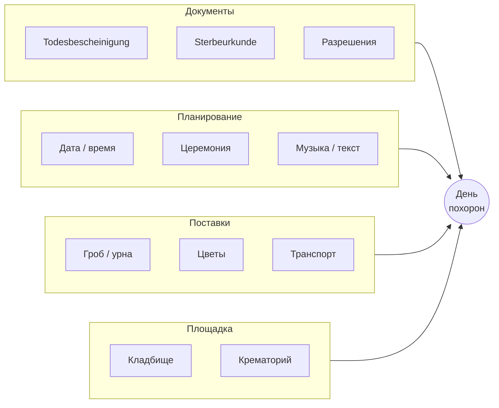

# Жизненный цикл услуги — step by step

> **Цель:** Полная карта процесса от первого контакта до закрытия дела — что, зачем, в каком порядке, автоматизировано ли.  
> **Бизнес-цель:** Показать, что MEMORA сопровождает весь путь, а не один модуль.  
> **Техническая цель:** Основа для Case workflow, статусов CRM и roadmap автоматизации.  
> **Зависимости:** [ECOSYSTEM.md](../ECOSYSTEM.md) · [ecosystem-infographic.md](../business/ecosystem-infographic.md)  
> **Интерактивная версия (GitHub Pages):** [timurkry.github.io/memora-platform/oekosystem/](https://timurkry.github.io/memora-platform/oekosystem/)

---

## Легенда автоматизации

| Обозначение | Значение |
|-------------|----------|
| **AUTO** | Автоматизировано в MEMORA (MVP или ближайший релиз) |
| **SEMI** | Частично: шаблоны, напоминания, статусы — решение человека |
| **MANUAL** | Вне платформы или полностью вручную координатором |
| **PLANNED** | Запланировано, ещё не в продукте |

---

## Обзор: от смерти до закрытия дела

---

## Этапы до заказа (семья → бюро)

| # | Этап | Кто | Зачем | Порядок | AUTO |
|---|------|-----|-------|---------|------|
| 0 | **Смерть, Leichenschau** | Врач | Todesbescheinigung — без неё процесс невозможен | До всего | MANUAL |
| 1 | **Первые решения семьи** | Семья | Завещание, страховка, семейная могила, Vorsorge | Параллельно с поиском бюро | PLANNED (гайды) |
| 2 | **Поиск бюро** | Семья | Выбор координатора всего процесса | После смерти, срочно | **AUTO** — web-public `/suchen` |
| 3 | **Консультация (Beratung)** | Бюро + семья | Сбор пожеланий, оценка объёма, доверие | До договора | SEMI — форма, запись |
| 4 | **Договор (Auftrag)** | Бюро + семья | Юридическое начало работы, фиксация услуг | **→ Заказ принят** | SEMI — CRM Case |

> **Точка «заказ принят»** — подписанный договор и созданный **Case** в CRM бюро. Дальше все шаги идут через координатора бюро в MEMORA.

---

## Этап бюро: детальная ветка (после заказа)

Похоронное бюро — **главный координатор**. Ниже — типовой порядок в Германии; отдельные шаги могут идти **параллельно**, но с зависимостями.

### Таблица шагов бюро (что · зачем · порядок · автоматизация)

| # | Шаг | Что делает бюро | Зачем | Зависит от | AUTO |
|---|-----|-----------------|-------|------------|------|
| 5 | Назначение координатора | Закрепляет ответственного в Case | Единая точка контакта для семьи | Заказ принят | **AUTO** — assign в CRM |
| 6 | Онбординг семьи | Доступ в портал, чек-лист пожеланий | Сбор данных без лишних звонков | Шаг 5 | SEMI — портал, формы |
| 7 | Перевозка тела | Заказ транспорта, маршрут, время | Юридически и логистически обязательный шаг | Todesbescheinigung | SEMI — задача + статус |
| 8 | Подготовка тела | Координация с моргом | По желанию семьи / традиции | Шаг 7 | MANUAL |
| 9 | Проверка мед. свидетельства | Контроль Todesbescheinigung | Блокер для регистрации | Врач (до бюро) | SEMI — чек-лист |
| 10 | Регистрация смерти | Sterbeurkunde в Standesamt | Официальный документ для кладбища/кремации | Шаг 9 | MANUAL → PLANNED (workflow) |
| 11 | Тип погребения | Решение: Erdbestattung / Feuerbestattung | Определяет всю дальнейшую ветку | Консультация | SEMI — поле в Case |
| 12 | Планирование церемонии | Дата, время, место, музыка, текст | Сердце клиентского опыта | Шаг 11 | SEMI — календарь |
| 13 | Гроб / урна | Заказ через каталог или marketplace | Обязательный товар | Шаг 11 | PLANNED — marketplace |
| 14 | Партнёры | Флорист, музыка, транспорт, кейтеринг | Доп. услуги церемонии | Шаг 12 | PLANNED — партнёрский кабинет |
| 15a | **Кладбище** | Участок, семейная могила, бронь слота | Юридическое место захоронения | Sterbeurkunde, тип | SEMI — запрос в кладбище |
| 15b | Zweite Leichenschau | Второй врачебный осмотр | Обязательно для кремации (DE) | Решение о кремации | MANUAL |
| 16b | Слот крематория | Бронирование времени | Пропускная способность | 15b | PLANNED |
| 17b | Кремация | Проведение, урна | Альтернатива захоронению тела | 16b | MANUAL — статус в Case |
| 18 | Счёт и оплата | Смета, счета, онлайн-оплата | Монетизация, прозрачность | Основные решения приняты | PLANNED — Stripe |
| 19 | **День похорон** | Транспорт → церемония → захоронение | Исполнение | Все слоты согласованы | SEMI — timeline дня |
| 20 | Закрытие Case | Архив документов, финальный статус | Юридическое завершение | Шаг 19 | **AUTO** — статус Closed |
| 21 | Aftercare | Памятник, уход, memorial, наследство | Долгосрочная связь с семьёй | После похорон | PLANNED |

---

## Параллельные потоки внутри бюро

После шага **11** (тип погребения) бюро ведёт **несколько потоков одновременно**:

| Поток | Ответственный в MEMORA | Сегодня | Цель |
|-------|------------------------|---------|------|
| Документы | Case → вкладка Documents | Чек-лист, загрузка файлов | Workflow + гос. API |
| Планирование | Case → Timeline | Календарь, задачи | Автосогласование слотов |
| Поставки | Marketplace / Orders | Ручной заказ | Каталог + комиссия |
| Площадка | Cemetery / Crematorium modules | Запрос по email/телефону | Онлайн-бронирование |

---

## День похорон — микро-цепочка

| # | Момент | Кто | AUTO |
|---|--------|-----|------|
| 19.1 | Сбор участников, транспорт к месту | Бюро, перевозчик | SEMI — маршрут |
| 19.2 | Церемония / прощание | Бюро, семья, священник | MANUAL |
| 19.3 | Захоронение или урна в землю | Кладбище | SEMI — статус «завершено» |
| 19.4 | Уведомление семьи | MEMORA | PLANNED — push / email |

---

## Aftercare (после закрытия Case)

| # | Задача | Кто инициирует | AUTO |
|---|--------|----------------|------|
| 21.1 | Изготовление памятника | Семья / бюро | PLANNED — marketplace |
| 21.2 | Уход за могилой | Семья | PLANNED — подписка партнёра |
| 21.3 | Цифровая страница памяти | Семья | PLANNED |
| 21.4 | Банки, страховые, наследство | Семья | MANUAL (информация) |

---

## Где MEMORA сегодня vs цель

| Зона | Сегодня (MVP) | Цель |
|------|---------------|------|
| Семья → бюро | Поиск, карта кладбища | Полный портал семьи, оплата, статус |
| Бюро | White Label + Case (в разработке) | Полный workflow таблицы выше |
| Кладбище | Демо-карта | Бронирование, участки, QR |
| Marketplace | Не запущен | Гробы, урны, венки, комиссия |
| Гос. API | Нет | Sterbeurkunde, разрешения |

---

## Связанные документы

| Документ | Содержание |
|----------|------------|
| [ecosystem-infographic.md](../business/ecosystem-infographic.md) | Hub-and-spoke, участники, flywheel |
| [ECOSYSTEM.md](../ECOSYSTEM.md) | Win-win по ролям |
| [prd/05-user-flows.md](../prd/05-user-flows.md) | Legacy flows (EN) |

---

*Обновлено: 2026-07-09*
