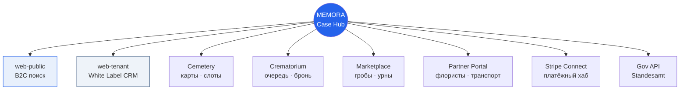
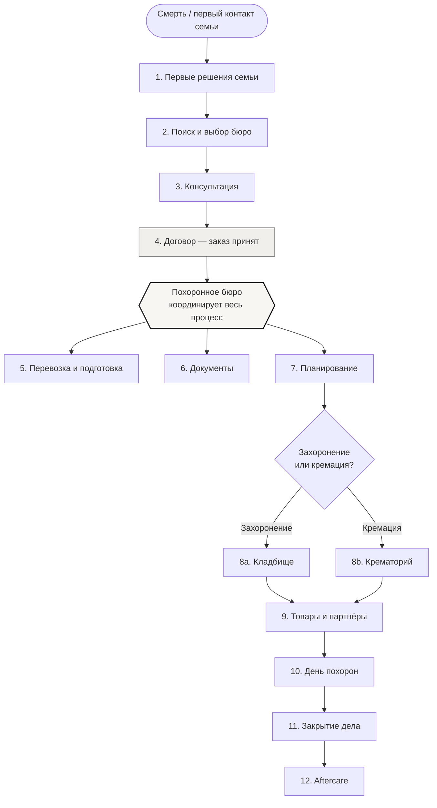
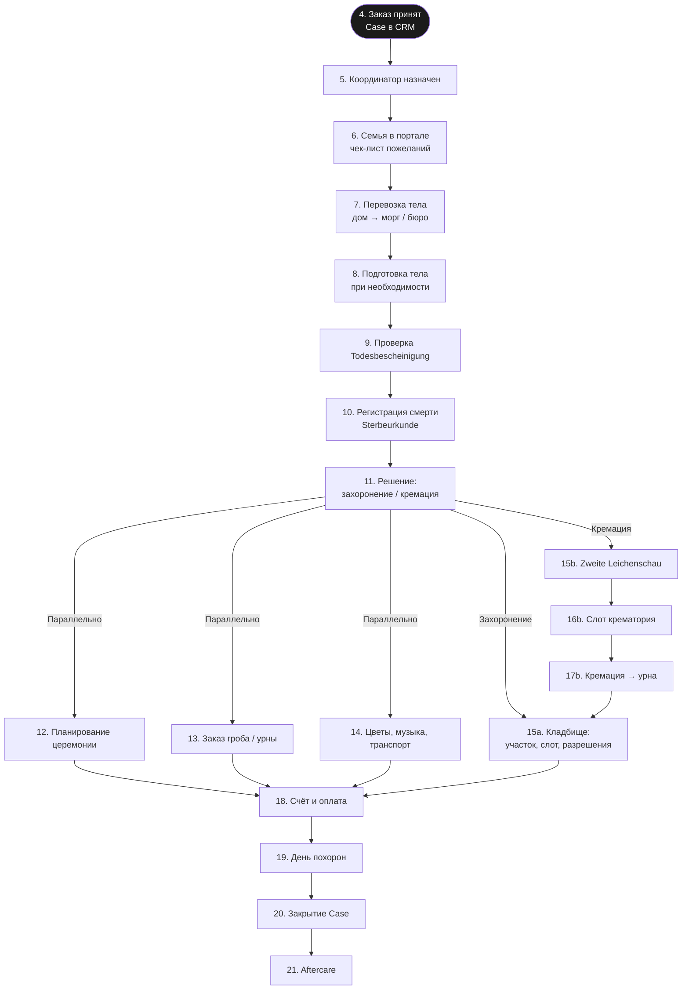
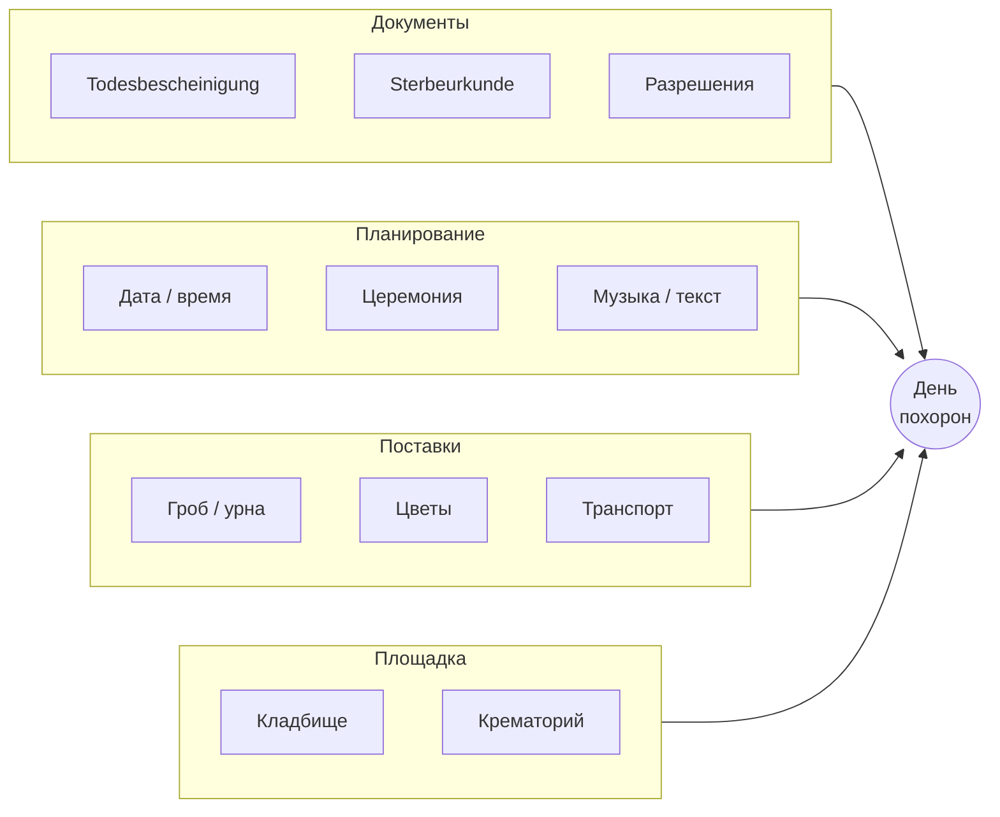

# Жизненный цикл услуги — step by step

> **Цель:** Полная карта процесса от первого контакта до закрытия дела — что, зачем, в каком порядке, автоматизировано ли.  
> **Бизнес-цель:** Показать, что MEMORA сопровождает весь путь, а не один модуль.  
> **Техническая цель:** Основа для Case workflow, статусов CRM и roadmap автоматизации.  
> **Зависимости:** [ECOSYSTEM.md](../ECOSYSTEM.md) · [ecosystem-infographic.md](../business/ecosystem-infographic.md)  
> **Интерактивная версия (GitHub Pages):** [timurkry.github.io/memora-platform/oekosystem/](https://timurkry.github.io/memora-platform/oekosystem/)

---

## Легенда автоматизации

| Обозначение | Значение |
|-------------|----------|
| **AUTO** | Автоматизировано в MEMORA (MVP или ближайший релиз) |
| **SEMI** | Частично: шаблоны, напоминания, статусы — решение человека |
| **MANUAL** | Вне платформы или полностью вручную координатором |
| **PLANNED** | Запланировано, ещё не в продукте |

## Легенда интеграции MEMORA

| Статус | Цвет на [инфографике](https://timurkry.github.io/memora-platform/oekosystem/) | Значение |
|--------|--------|----------|
| **В проде** | Сплошной синий | Модуль уже работает (напр. web-public `/suchen`) |
| **Мост** | Синий пунктир | MEMORA связывает стороны: Case, задачи, документы |
| **Roadmap** | Серый пунктир | Запланировано: API, marketplace, гос. интеграции |
| **Вне платформы** | Нейтральный | Пока нет цифрового контура MEMORA |

**Принцип:** участники **не** обмениваются данными напрямую — только через MEMORA (Case как единый ID дела).

---

## Карта модулей — куда интегрируемся

---

## Обзор: от смерти до закрытия дела

---

## Этапы до заказа (семья → бюро)

| # | Этап | Кто | Зачем | Порядок | AUTO | **MEMORA** |
|---|------|-----|-------|---------|------|------------|
| 0 | **Смерть, Leichenschau** | Врач | Todesbescheinigung | До всего | MANUAL | Roadmap: Ratgeber |
| 1 | **Первые решения семьи** | Семья | Завещание, Vorsorge | Параллельно | PLANNED | Roadmap: Vorsorge |
| 2 | **Поиск бюро** | Семья | Выбор координатора | Срочно | AUTO | **В проде:** web-public `/suchen` |
| 3 | **Консультация** | Бюро + семья | Сбор пожеланий | До договора | SEMI | **Мост:** запись → лид CRM |
| 4 | **Договор (Auftrag)** | Бюро + семья | Начало работы | **Заказ принят** | SEMI | **Мост:** Case в CRM |

> **Точка «заказ принят»** — подписанный договор и созданный **Case** в CRM бюро. Дальше все шаги идут через координатора бюро в MEMORA.

---

## Этап бюро: детальная ветка (после заказа)

Похоронное бюро — **главный координатор**. Ниже — типовой порядок в Германии; отдельные шаги могут идти **параллельно**, но с зависимостями.

### Таблица шагов бюро (что · зачем · порядок · автоматизация · MEMORA)

| # | Шаг | Что делает бюро | Зависит от | AUTO | **MEMORA — модуль · как** |
|---|-----|-----------------|------------|------|---------------------------|
| 5 | Назначение координатора | Закрепляет ответственного | Заказ принят | AUTO | **Мост:** CRM assign → timeline |
| 6 | Онбординг семьи | Портал, чек-лист | Шаг 5 | SEMI | Roadmap: Family Portal → Case |
| 7 | Перевозка тела | Транспорт, маршрут | Todesbescheinigung | SEMI | **Мост:** задача Case → партнёр |
| 8 | Подготовка тела | Координация с моргом | Шаг 7 | MANUAL | Roadmap: статус морга |
| 9 | Проверка мед. свидетельства | Контроль документа | Этап 0 | SEMI | **Мост:** Documents checklist |
| 10 | Регистрация смерти | Sterbeurkunde | Шаг 9 | MANUAL | Roadmap: workflow + Gov API |
| 11 | Тип погребения | Erdbestattung / Feuerbestattung | Консультация | SEMI | **Мост:** Case field → ветка workflow |
| 12 | Планирование церемонии | Дата, место, музыка | Параллельно | SEMI | **Мост:** Calendar web-tenant |
| 13 | Гроб / урна | Заказ товара | Параллельно | PLANNED | Roadmap: Marketplace → Case |
| 14 | Партнёры | Флорист, музыка | Параллельно | PLANNED | Roadmap: Partner Portal |
| 15a | **Кладбище** | Участок, слот | Sterbeurkunde | SEMI | **Мост:** Cemetery + Mapbox → tenant |
| 15b | Zweite Leichenschau | Второй врач | Кремация | MANUAL | Roadmap: Documents |
| 16b | Слот крематория | Бронирование | 15b | PLANNED | Roadmap: Crematorium SaaS |
| 17b | Кремация → урна | Урна | 16b | MANUAL | Roadmap: webhook → Case |
| 18 | Счёт и оплата | Смета, оплата | Решения | PLANNED | Roadmap: Stripe Connect (хаб) |
| 19 | **День похорон** | Церемония → захоронение | Все слоты | SEMI | **Мост:** Timeline + Mapbox маршрут |
| 20 | Закрытие Case | Архив | День похорон | AUTO | **Мост:** Case Closed + аналитика |
| 21 | Aftercare | Памятник, уход | После | PLANNED | Roadmap: Marketplace + Memorial |

---

## Параллельные потоки внутри бюро

После шага **11** (тип погребения) бюро ведёт **несколько потоков одновременно**:

| Поток | Ответственный в MEMORA | Сегодня | Цель |
|-------|------------------------|---------|------|
| Документы | Case → вкладка Documents | Чек-лист, загрузка файлов | Workflow + гос. API |
| Планирование | Case → Timeline | Календарь, задачи | Автосогласование слотов |
| Поставки | Marketplace / Orders | Ручной заказ | Каталог + комиссия |
| Площадка | Cemetery / Crematorium modules | Запрос по email/телефону | Онлайн-бронирование |

---

## День похорон — микро-цепочка

| # | Момент | Кто | AUTO |
|---|--------|-----|------|
| 19.1 | Сбор участников, транспорт к месту | Бюро, перевозчик | SEMI — маршрут |
| 19.2 | Церемония / прощание | Бюро, семья, священник | MANUAL |
| 19.3 | Захоронение или урна в землю | Кладбище | SEMI — статус «завершено» |
| 19.4 | Уведомление семьи | MEMORA | PLANNED — push / email |

---

## Aftercare (после закрытия Case)

| # | Задача | Кто инициирует | AUTO |
|---|--------|----------------|------|
| 21.1 | Изготовление памятника | Семья / бюро | PLANNED — marketplace |
| 21.2 | Уход за могилой | Семья | PLANNED — подписка партнёра |
| 21.3 | Цифровая страница памяти | Семья | PLANNED |
| 21.4 | Банки, страховые, наследство | Семья | MANUAL (информация) |

---

## Где MEMORA сегодня vs цель

| Зона | Сегодня (MVP) | Цель |
|------|---------------|------|
| Семья → бюро | Поиск, карта кладбища | Полный портал семьи, оплата, статус |
| Бюро | White Label + Case (в разработке) | Полный workflow таблицы выше |
| Кладбище | Демо-карта | Бронирование, участки, QR |
| Marketplace | Не запущен | Гробы, урны, венки, комиссия |
| Гос. API | Нет | Sterbeurkunde, разрешения |

---

## Связанные документы

| Документ | Содержание |
|----------|------------|
| [ecosystem-infographic.md](../business/ecosystem-infographic.md) | Hub-and-spoke, участники, flywheel |
| [ECOSYSTEM.md](../ECOSYSTEM.md) | Win-win по ролям |
| [prd/05-user-flows.md](../prd/05-user-flows.md) | Legacy flows (EN) |

---

*Обновлено: 2026-07-09*
